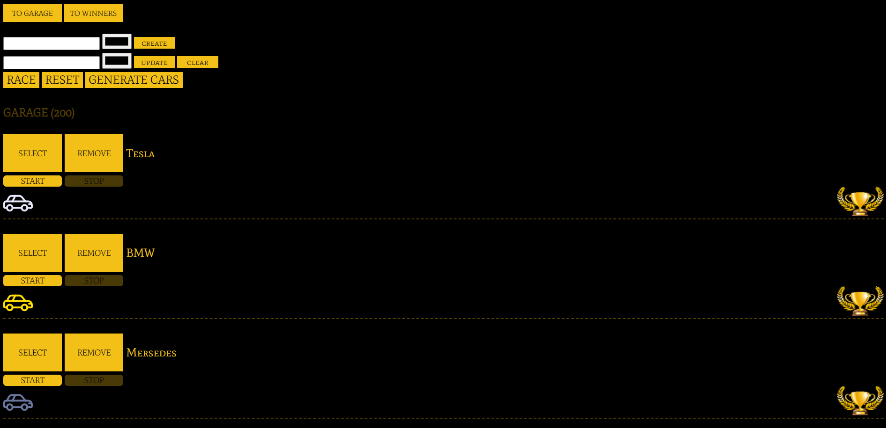

[Deploy](https://async-race-uzuzer567.netlify.app/)

For the application to start working, you need to start the [server](https://github.com/mikhama/async-race-api)

# On the project used:
* TypeScript
* Sass
* Eslint
* Webpack

# How to start project:
1. `npm install`
2. `npm start`
